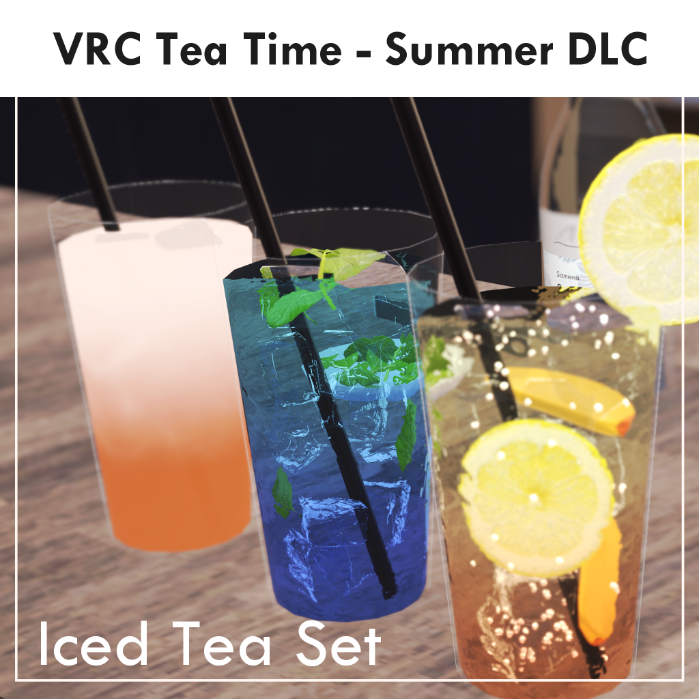

# VRC Tea Time 夏 - 涼やかガラスとアイスティー（Manual）

© 2026 Sameno Works(sumisame) All rights reserved.

[Booth Link](https://sameno.booth.pm/items/8882685)

---

更新履歴 / Release

- 2026/09/22: Manual v1.0.0 Released. 

# DLC 内容物

本DLCでは、「VRC Tea Time」シリーズに、季節を取り入れた様々な追加要素をご利用いただくことができます。　　

本商品は「四季シリーズ」の第二弾です。季節ごとに異なる雰囲気のティータイムをお楽しみいただけます。

- Summer DLCの内容物

  - ロンググラス

  - アイスペールとスコップ

  - 炭酸水

  - ミント皿とミントトング

  - フレーバーシロップ（ベリー、ピーチ、レモン）

※紅茶を入れる際は、ティーセット本体のポット等をご利用ください。

# 事前準備

本パッケージを使用する際は、Unity 2022.3.22f1のプロジェクトをご用意ください。

Unity 2019とは互換性がありませんのでご注意ください。

VRCSDKは ver3.10.0以降を必ず使用してください。本パッケージはWorld Phys Boneを使用します。

本商品はUdonSharp(U#)を使用しています。VCC(VRChat Creator Companion)のWorlds U#でプリインストールされている最新バージョンの U# を使用してください。

VCC経由でインストールされるU#以外のバージョンは動作サポート対象外とさせていただきます。  

本商品はシェーダーにliltoonを使用しています。 

本商品をインストールする前に、以下URLまたはVCCより最新の「liltoon」をプロジェクトにインポートしてください。

[liltoon](https://lilxyzw.booth.pm/items/3087170)

※本商品は、「liltoon v2.3.4」をベースとしたカスタムシェーダーをドリンクの液体に使用しています。

ドリンクの液体描画が正常に行われない場合は、一度上記バージョンへのダウングレードをご検討ください。

# セットアップ

## 導入

### ● 事前導入

事前に、必ずVRC Tea Time 紅茶セット（Worldギミック）を先にUnity プロジェクトに導入してください。

本DLCは単独では動作しません。

### ● 本導入

本DLCのZipファイルを解凍します。  

ファイルに含まれるUnitypackageファイル「TeaSetDLC_FourSeasons_S02_v1.0.unitypackage」を最新の本体パッケージ導入済みのプロジェクトにインポートします。

Unitypackageファイルをインポート後、「Assets\SamenoLab\VRCTeaTime\DLC\FourSeasons\S02_Summer」にあるPrefab「TeaSet_FourSeasons 02-Summer」をScene内の任意の場所に配置します。

以上でセットアップは完了です。

ティーポットやミルク等は、TeaSet本体のものをご利用ください。  

### オブジェクトの複製

「TeaSet_FourSeasons 02-Summer」の直下にあるオブジェクトは「ctrl+D」で複製可能です。

Unity上での複製後の設定は特に必要ありません。

# ギミックの仕様

## アイスドリンクの作り方
はじめにロンググラスに氷を入れて、ティーセット本体で淹れた紅茶（またはバタフライピー、ローズティー）をグラスに注ぎます。

最後まで紅茶を入れ続けるか、途中で炭酸水を入れるとドリンクが完成します。

### ● アイスティー／ティーソーダの作り分け

グラスに紅茶を注ぐと、最初は容量の約60％まで注がれます。

その後、もう一度紅茶を注ぐとアイスティーとして完成し、ソーダを注ぐとティーソーダとして完成します。

1回目の紅茶をベースに、2回目に注ぐ飲み物によって完成するドリンクが変化します。

## スパークリングドリンクの作り方
氷を入れたグラスに、紅茶の代わりにはじめから炭酸水を入れると、スパークリングドリンクが完成します。

※最初に炭酸を入れた場合、あとから紅茶を入れることができません。ティーソーダを作る場合は、初めに紅茶を入れる必要があります。

## フレーバーシロップの追加
完成したドリンクには、後入れでフレーバーシロップを入れることができます。

### ● フレーバーシロップの種類
- ベリーシロップ（ブルーベリー、ラズベリー）
- ピーチシロップ
- レモンシロップ

## オプション
完成したドリンクには、各種オプションを入れることができます。

### ● ストロー

完成したドリンクには、任意でストローを差すことができます。

ストローは、ストローホルダーをインタラクトして取得可能です。

未使用のストローは、ストローホルダーに触れるか、ストローホルダーの下部についているリセットボタンを押すことで回収されます。

### ● ミント

付属のミントトングを使用して、ミント皿から取ったミントを完成したドリンクに入れることができます。

ミントは、どのドリンクにも入れることができます。

### ● ミルク

ティーセット本体のミルクポットを使用して、アイスミルクティーを作ることができます。

ミルクは、ストレートのアイスティー、またはアイスピーチティーに入れることができます。

### ● 発光エッセンス（Emission演出）

蛍光色の液体が入った試験管は、ドリンクに発光演出を加えるための特殊アイテムです。

完成したドリンクに液体を加えると、ドリンクのEmissionが有効になり、液体全体がほのかに発光します。

味やレシピには影響せず、見た目のみを変化させる演出用のオプションです。

エミッションの強度が弱い試験管（Alphaと書かれた黄緑色の瓶）と、強い試験管（Betaと書かれたピンク色の瓶）の2種を用意しています。

エミッションの強度は、以下のアニメーションの設定値を変更することで調整可能です。

・S02_Summer > Animation > LongGlass 

** Emission_1.anim：弱いエミッション **

60フレームのRIM Color r, g, bの各値を1以上の任意の値に設定。大きいほど明るくなります。

※（r,g,b = 1, 1, 1) はエミッションが無い状態です。デフォルト値は （r,g,b = 1.6, 1.6, 1.6)です。

** Emission_2.anim：強いエミッション **

60フレームのRIM Color r, g, bの各値を1以上の任意の値に設定。大きいほど明るくなります。

※デフォルト値は （r,g,b = 3.2, 3.2, 3.2)です。

## 作成可能なドリンクの組み合わせ

フレーバーシロップを最大2種類まで組み合わせて、全45種類のドリンクを作成可能です。

本DLCで作成可能なドリンクの組み合わせは以下の通りです。

### ● アイスティー系（20種）
- アイスティー（ベース：紅茶）
  - アイスレモンティー（レモン🍋）
  - アイスピーチティー（ピーチ🍑）
  - アイスベリーティー（ベリー🫐）
  - ピーチレモンティー（ピーチ🍑×レモン🍋）
  - ピーチベリーティー（ピーチ🍑×ベリー🫐）
  - レモンベリーティー（レモン🍋×ベリー🫐）
  - ミルクティー（ミルク🥛）
  - ミルクピーチティー（ミルク🥛×ピーチ🍑）
- ブルーティー（ベース：バタフライピーティー）
  - ミスティックティー（レモン🍋）
  - ベリーブルーティー（ベリー🫐）
  - ベリーミスティックティー（レモン🍋×ベリー🫐）
- ハイビスカスティー（ベース：ローズティー）
  - ハイビスカスレモンティー（レモン🍋）
  - ハイビスカスピーチティー（ピーチ🍑）
  - ハイビスカスベリーティー（ベリー🫐）
  - ハイビスカスピーチレモンティー（ピーチ🍑×レモン🍋）
  - ハイビスカスピーチベリーティー（ピーチ🍑×ベリー🫐）
  - ハイビスカスレモンベリーティー（レモン🍋×ベリー🫐）

### ● ティーソーダ系（18種）
- ティーソーダ（ベース：紅茶 + 炭酸水）
  - レモンティーソーダ（レモン🍋）
  - ピーチティーソーダ（ピーチ🍑）
  - ベリーティーソーダ（ベリー🫐）
  - ピーチレモンティーソーダ（ピーチ🍑×レモン🍋）
  - ピーチベリーティーソーダ（ピーチ🍑×ベリー🫐）
  - レモンベリーティーソーダ（レモン🍋×ベリー🫐）
- ブルーティーソーダ（ベース：バタフライピーティー + 炭酸水）
  - ミスティックティーソーダ（レモン🍋）
  - ベリーブルーティーソーダ（ベリー🫐）
  - ベリーミスティックティーソーダ（レモン🍋×ベリー🫐）
- ハイビスカスティーソーダ（ベース：ローズティー + 炭酸水）
  - ハイビスカスレモンティーソーダ（レモン🍋）
  - ハイビスカスピーチティーソーダ（ピーチ🍑）
  - ハイビスカスベリーティーソーダ（ベリー🫐）
  - ハイビスカスピーチレモンティーソーダ（ピーチ🍑×レモン🍋）
  - ハイビスカスピーチベリーティーソーダ（ピーチ🍑×ベリー🫐）
  - ハイビスカスレモンベリーティーソーダ（レモン🍋×ベリー🫐）

### ● スパークリングドリンク系（7種）
- ソーダ（ベース：炭酸水）
  - レモネード（レモン🍋）
  - ピーチソーダ（ピーチ🍑）
  - ベリーソーダ（ベリー🫐）
  - ピンクレモネード（ピーチ🍑×レモン🍋）
  - ピーチベリーソーダ（ピーチ🍑×ベリー🫐）
  - ベリーレモネード（レモン🍋×ベリー🫐）

# お問い合わせ

不具合やご不明点に関するお問い合わせはBoothメッセージまでご連絡ください。  

[https://sameno.booth.pm/](https://sameno.booth.pm/)

本商品を使用した作品のシェアは、ハッシュタグ「#さめのワークス」をご活用ください！  